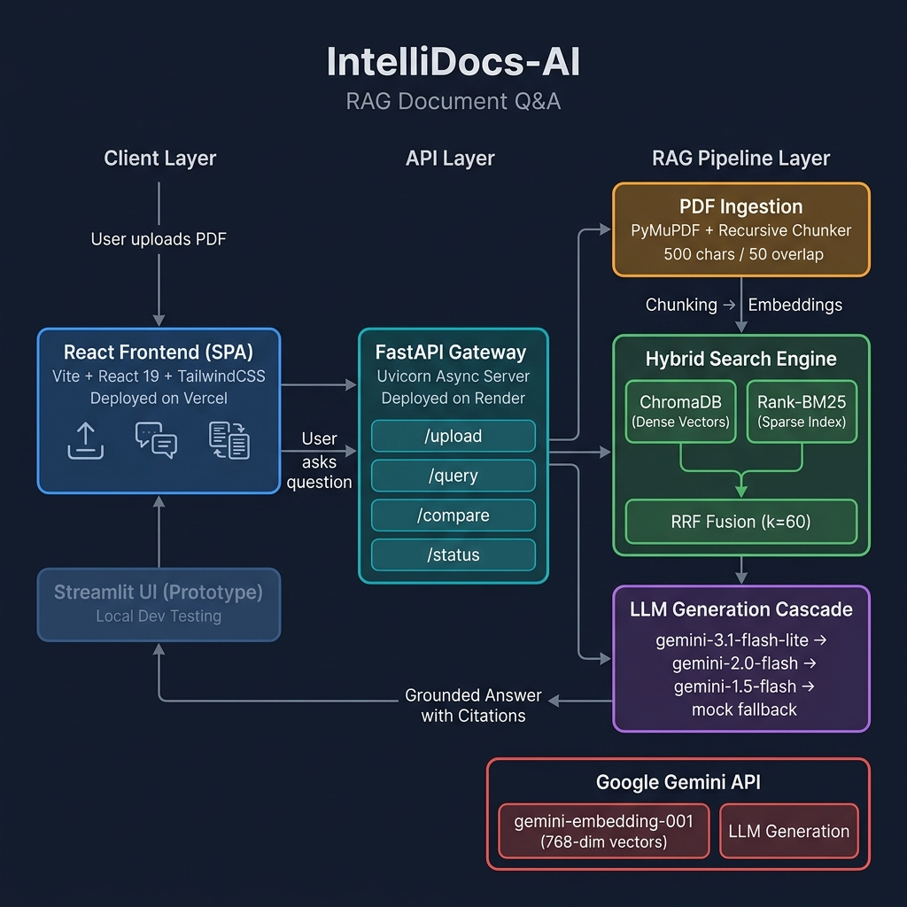
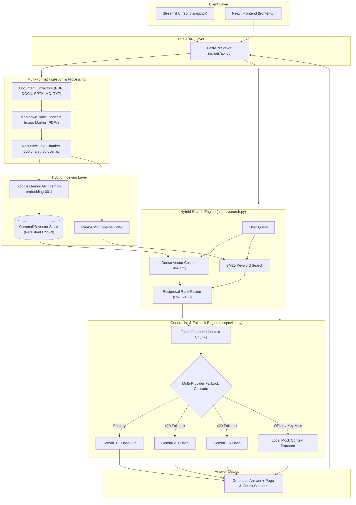

# 🚀 IntelliDocs-AI

> **An AI-powered Retrieval-Augmented Generation (RAG) platform enabling semantic search, multi-provider LLM answer synthesis, inline citations, and multi-document comparative analysis over multi-format document corpora (PDF, DOCX, PPTX, Markdown, and TXT).**

<p align="center">


-yellow?logo=pytest)


</p>

---

## 🎥 Demo

- **Live Deployed App (React Frontend):** [https://intellidocs-ai-tau.vercel.app](https://intellidocs-ai-tau.vercel.app)
- **Live Deployed API (FastAPI Backend):** [https://intellidocs-api-yedx.onrender.com](https://intellidocs-api-yedx.onrender.com)
- **Demo Walkthrough Video (Loom):** [▶️ Watch 3-Min Loom Walkthrough](https://www.loom.com/share/a103a99f1ece4e61bd1b851023f6724f)
- **Demo Prototype Video (Google Drive):** [Watch Product Demo Video](https://drive.google.com/file/d/1M6AxdbiT9fYv4QrJI_NGNFW7MyIIgBlA/view?usp=sharing)
- **Live Local REST API:** `http://localhost:8000` (FastAPI Server)
- **Live Local Streamlit UI:** `http://localhost:8501` (Streamlit App)
- **Live Local React UI:** `http://localhost:5173` (Vite + React SPA)

---

## 📌 Problem Statement

Reading and locating specific information inside long documents (e.g., PDFs, DOCX files, PowerPoint slide decks, Markdown pages, and Text files) is time-consuming and inefficient. Traditional keyword searches fail when user queries use different phrasing or conceptual terminology than the source document.

**IntelliDocs-AI** solves this by implementing an end-to-end Retrieval-Augmented Generation (RAG) pipeline. It extracts text and structural elements (markdown tables and image placeholders) from multiple document formats (PDF, DOCX, PPTX, MD, and TXT) using specialized extractors (PyMuPDF, python-docx, python-pptx, and native markdown/text parsers), splits the text into 500-character semantic chunks with 50-character overlap, generates 768-dimensional dense vectors using Google Gemini Embeddings (`gemini-embedding-001`) to support memory-safe cloud deployment, indexes them in ChromaDB alongside an in-memory BM25 sparse index, and combines search results via Reciprocal Rank Fusion (RRF $k=60$). Retrieved chunks are passed as context to Google Gemini to synthesize grounded answers backed by chunk-level source citations.

---

## 🏗️ Architecture Diagram

*The system uses a 5-tier architecture connecting the React frontend, FastAPI gateway, chunking ingestion pipeline, hybrid HNSW vector + BM25 keyword index, and resilient multi-model Gemini LLM fallback cascade.*





---

## 🛠️ Tech Stack

| Component Layer | Tool / Technology | Version / Specification | Rationale & Usage |
|-----------------|-------------------|-------------------------|-------------------|
| **Core Runtime** | Python | 3.12 | Primary backend language for NLP and API server |
| **Document Extraction** | PyMuPDF (`fitz`), python-docx, python-pptx | 1.23+ / 1.2.0 / 1.0.2 | Extracts text and structural components from PDFs, DOCX, PPTX, Markdown, and TXT files |
| **Text Segmentation** | Custom Recursive Chunker | 500 chars / 50 overlap | Retains cohesive paragraph context while preventing semantic dilution |
| **Dense Embeddings** | Google Gemini API | `gemini-embedding-001` | 768-dimensional dense vectors (migrated from local Sentence Transformers to resolve Render RAM OOM) |
| **Vector DB** | ChromaDB | 1.5.9 | Local persistent HNSW vector store with metadata filtering |
| **Sparse Index** | Rank-BM25 | 0.2.2 | Okapi BM25 algorithm for exact keyword matching |
| **Rank Fusion** | Reciprocal Rank Fusion | RRF ($k=60$) | Fuses dense and sparse rankings into a unified score |
| **Primary LLM** | Google Gemini API | `gemini-3.1-flash-lite` | Context-aware answer synthesis via `google-genai` SDK |
| **Fallback LLM Tier** | Google Gemini Cascade | `gemini-2.0-flash`, `gemini-1.5-flash` | Cascades automatically on HTTP 429 rate limits |
| **Offline Fallback** | Local Mock Extractor | Built-in | Graceful offline context extraction when APIs are down |
| **Backend API** | FastAPI + Uvicorn | 0.109+ | Async REST API (`/upload`, `/query`, `/compare`, `/collections`, `/status`) |
| **Web Interface 1** | Streamlit | 1.30+ | Python interactive web app (`scripts/app.py`) |
| **Web Interface 2** | React + Vite | React 19 / Vite 8 | Single Page Application (SPA) in `frontend/` |
| **Testing** | Pytest | 9.1+ | Automated test suite across 8 modules (10/10 passed) |

---

## ⚙️ Quickstart

### Prerequisites
- Python 3.10+ (Python 3.12 recommended)
- Node.js 18+ (optional, for React frontend)

### Step 1: Clone the Repository
```bash
git clone https://github.com/rajeevkrsingh17/IntelliDocs-AI.git
cd IntelliDocs-AI
```

### Step 2: Set Up Virtual Environment & Dependencies
```bash
# Create virtual environment
python -m venv venv

# Activate virtual environment
# Windows (PowerShell):
.\venv\Scripts\Activate.ps1
# Linux / macOS:
source venv/bin/activate

# Install dependencies
pip install -r requirements.txt
```

### Step 3: Configure Environment Variables
Create a `.env` file in the `scripts/` directory:
```env
GEMINI_API_KEY=your_gemini_api_key_here
GEMINI_MODEL=gemini-2.0-flash
```

### Step 4: Run the Application

#### Option A: Launch Streamlit Web UI (Direct Python Application)
```bash
python -m streamlit run scripts/app.py
```
*Open browser at `http://localhost:8501`*

#### Option B: Launch FastAPI REST Server & React Frontend
```bash
# Terminal 1: Run FastAPI backend
python -m uvicorn scripts.api:app --reload --port 8000

# Terminal 2: Run React frontend
cd frontend
npm install
npm run dev
```
*Access React UI at `http://localhost:5173` and Swagger docs at `http://localhost:8000/docs`*

### Step 5: Run Automated Tests
```bash
pytest
```
*Output: 10 passed test cases across 8 test suites.*

---

## 📊 Data Sources

IntelliDocs-AI operates over multi-format document corpora uploaded dynamically by users or placed in `data/raw/` and `data/uploads/`.
- Supported input formats: `.pdf`, `.docx`, `.pptx`, `.md`, `.txt` (with readable text, tables, and structural elements).
- Metadata attached to every indexed chunk: `document_name`, `document_type`, `chunk` (sequential index), `page` (calculated page number), `upload_time`.

---

## 📂 Repository Structure

```
IntelliDocs-AI/
├── frontend/                  # React + Vite SPA (deployed on Vercel)
│   ├── src/                   # React components & pages
│   ├── public/                # Static assets
│   ├── index.html
│   ├── vite.config.js
│   ├── package.json
│   └── vercel.json            # Vercel rewrite rules
├── scripts/                   # Backend application code
│   ├── api.py                 # FastAPI REST server
│   ├── app.py                 # Streamlit UI
│   ├── vector_store.py        # ChromaDB ingestion & retrieval
│   ├── search.py              # Hybrid search (Dense + BM25 + RRF)
│   ├── llm.py                 # LLM fallback cascade engine
│   ├── chunker.py             # Recursive text chunker
│   ├── document_processor.py  # PDF extraction orchestrator
│   ├── embeddings.py          # Gemini embedding wrapper
│   └── .env                   # API keys (not committed)
├── docs/                      # Project documentation
│   ├── adr/                   # Architecture Decision Records
│   │   ├── ADR-001-vector-store.md
│   │   ├── ADR-002-gemini-integration.md
│   │   ├── ADR-003-source-citation.md
│   │   └── ADR-004-model-fallback.md
│   ├── architecture_diagram.png
│   ├── reflection.md
│   ├── roadmap_3rd_year.md
│   ├── resume_bullets.md
│   ├── resume_final.md
│   ├── mock_interview.md
│   ├── postmortem.md
│   ├── status-one-pager.md
│   └── showcase_slide_content.md
├── tests/                     # Pytest test suites (10 tests)
│   ├── conftest.py
│   ├── test_chunker.py
│   ├── test_search.py
│   ├── test_health.py
│   ├── test_pdf_parser.py
│   ├── test_vector_store.py
│   ├── test_embedding_service.py
│   ├── test_eval.py
│   └── test_rag_pipeline.py
├── data/                      # PDF uploads & processed ChromaDB
├── requirements.txt           # Python dependencies
├── render.yaml                # Render deployment config
├── .gitignore
└── README.md
```

---

## 📑 ADRs

All core architecture decisions are documented in [`docs/adr/`](docs/adr/):

- [ADR-001: Selection of ChromaDB as Vector Database](docs/adr/ADR-001-vector-store.md)
- [ADR-002: Google Gemini as Primary LLM & Embedding Provider](docs/adr/ADR-002-gemini-integration.md)
- [ADR-003: Chunk-Level Source Citation for Answer Transparency](docs/adr/ADR-003-source-citation.md)
- [ADR-004: Resilient LLM Fallback Cascade Engine](docs/adr/ADR-004-model-fallback.md)

---

## ✨ Mini-Extension

IntelliDocs-AI includes two major mini-extensions that go beyond standard single-file RAG tutorials:

1. **Multi-Document Comparative Analysis Engine:**
   - Allows users to select multiple uploaded documents (PDFs, DOCX, PPTX, MD, TXT) and generate comparative reports.
   - Provides 4 comparison modes: `summary`, `similarities`, `detailed`, and `custom`.

2. **Resilient LLM Fallback Cascade:**
   - Detects HTTP 429 quota limits and instantly cascades across model tiers (`gemini-2.0-flash` → `gemini-1.5-flash` → `mock`).
   - Differentiates 429 quota errors (cascade immediately) from 503 service errors (retry 3 times with 5s delay).

---

## ⚠️ Known Limitations

- **Scanned Image-Only PDFs:** Pure scanned image PDFs without an embedded OCR text layer require pre-OCR processing (planned for 3rd-year extension).
- **Large File Processing Latency:** Parsing and generating dense embeddings for 200+ page PDFs takes 15–30 seconds on local CPU hardware.

---

## 🗺️ What I'd Do in 3rd Year

See the complete 12-month roadmap in [`docs/roadmap_3rd_year.md`](docs/roadmap_3rd_year.md):
- Hybrid search optimization with Qdrant and pgvector.
- Multimodal document analysis (extracting and indexing images and charts using Vision-Language Models).
- Agentic RAG workflows (query decomposition and self-verification using LangGraph).
- Containerized cloud deployment with Docker Compose, GitHub Actions CI/CD, and Prometheus metrics.

---

## 📄 License + Acknowledgements

- **License:** MIT License
- **Developer:** Rajeev Kumar (B.Tech CSE - AI & Data Engineering, Lovely Professional University)
- **Segment:** Foundations of Applied Machine Learning (Summer Internship 2026)
- **Problem Statement Code:** `I2 – Document Q&A (RAG over a Focused Corpus)`
